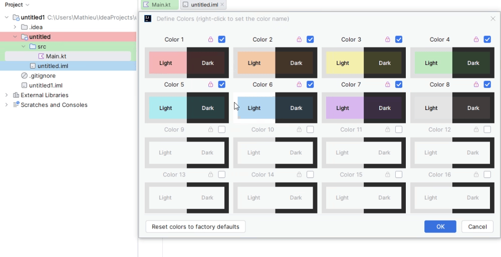
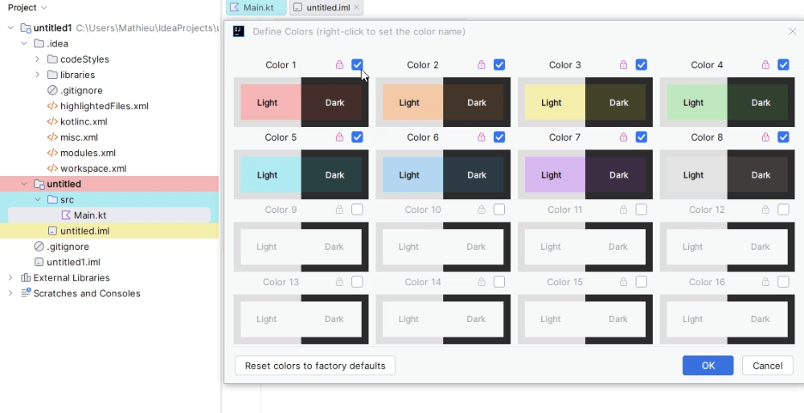
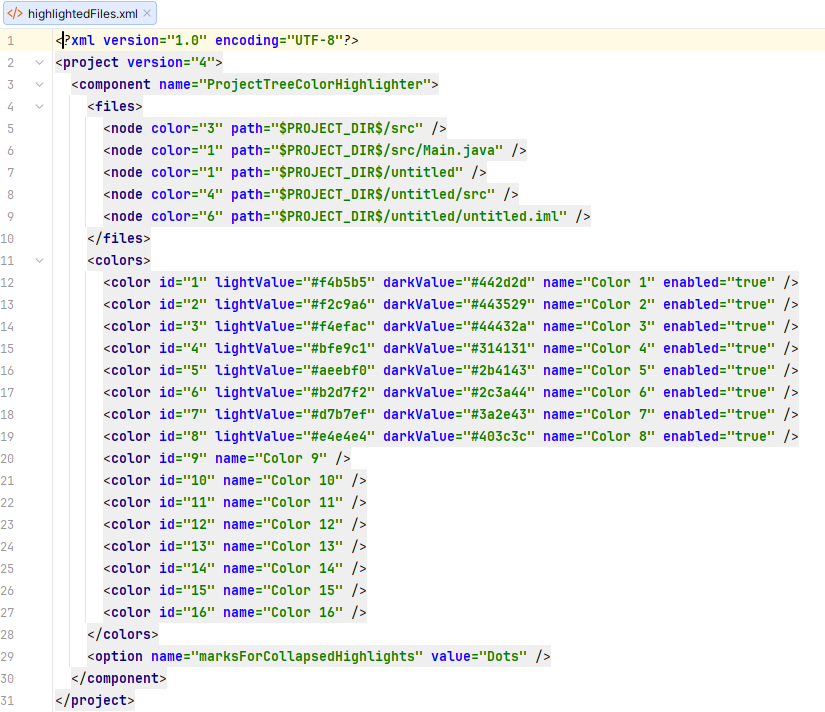

# ProjectTree Color Enhanced

<!-- Plugin description -->
Highlights your project files and folders in colors.
<!-- Plugin description end -->

For those looking for the compiled version, you can find it in the **[JetBrains Marketplace](https://plugins.jetbrains.com/plugin/32284-projecttree-color-enhanced/)** or install it directly from your
IDE's plugin manager.

If you need older versions, you can find them in the
original [ProjectTree Color Highlighter repository](https://github.com/pnbarx/idea-treecolor) by Pavel Barykin.

## 🥰 Support My Work

If you appreciate my work, consider ⭐ starring this repository or 💰 making a donation to support
future updates and maintenance.

## Some Context

When you are working on a large complex project you may need to highlight some of its parts in different colors.

Previously, there was only one way to do this:
create a scope, specify its name and filename pattern, then add a color and attach it to the created scope, then click
`Ok` and `Apply`
to see how it looks now. If the color doesn't fit, double-click it, select a new color, click `OK` and `Apply` again to
see the changes. If the color doesn't fit again - repeat until it fits. This is a rather inconvenient way (and takes a
lot of time 🙄). **ProjectTree Color Enhanced** was made to get rid of this inconvenience.

## Usage

- Highlight your files and folders with ease
using the context menu:

    

- Adjust the colors using the color picker, get an instant preview of the project tree and editor
tabs while adjusting:

    

- Colors are theme-aware, so you can have different colors for light and dark themes:

    

- All settings are persistently stored in the `.idea/highlightedFiles.xml`, so you can read and change it externally,
clone or copy-paste to other projects, etc. (This allows you to create various project boilerplates with predefined
highlighting settings.)

    

